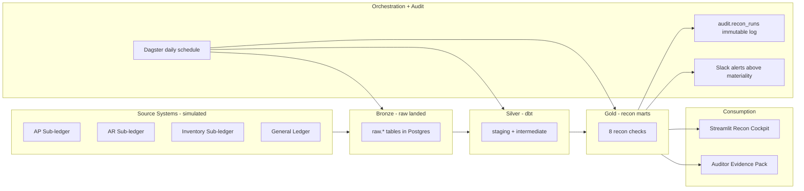

# Daily General Ledger Reconciliation

Reconciliation-as-code for finance: a daily, automated pipeline that proves AP, AR, and Inventory sub-ledgers tie out to the General Ledger — modeled on the controls a Big-4-audited finance team would actually ship.


---

## TL;DR

A production-shaped GL reconciliation system built for a senior data analyst / analytics engineer portfolio. Generates ~50K realistic AP / AR / Inventory / GL postings with intentional breaks (timing, amount, missing posting, unauthorized JE, FX rounding), then reconciles them with declarative tolerance rules in dbt + Python and surfaces results in a Streamlit cockpit with a SOX-style audit trail.

---

## Why this matters

Daily GL reconciliation is a SOX-relevant control at every public company. A break that goes unflagged for a week can become a material misstatement. Modern finance-data teams are moving away from manual BlackLine workbooks toward **reconciliation-as-code**: declarative rules in git, versioned tolerances, automated daily runs, materiality-thresholded alerts, and immutable audit evidence. This project demonstrates that pattern end-to-end.

---

## Architecture



---

## Tech stack

| Layer | Tool | Why |
|---|---|---|
| **Core: Storage** | PostgreSQL 16 | Same SQL surface as Snowflake/Redshift. Schemas mirror a medallion warehouse (`raw`, `staging`, `intermediate`, `marts`, `audit`). |
| **Core: Transformation** | dbt-core 1.8+ | The 2026 industry standard for analytics-engineering. Models, tests, snapshots, contracts, unit tests. |
| **Core: Recon engine** | Python 3.13 (typed, pydantic v2, structlog) | Tolerance-based matching, break categorization, reusable across recons. |
| Supporting: Orchestration | Dagster | Daily schedule and asset checks. |
| Supporting: Validation | Great Expectations | Source-layer expectation suites. |
| Supporting: UI | Streamlit | Multi-page Recon Cockpit. |
| Supporting: Alerting | Slack webhook | Materiality-thresholded daily digest. |
| Supporting: Containerization | Docker | One `docker-compose.yml` for Postgres. |

The supporting stack is deliberately minimal. **The interview is about SQL, dbt, and Python.**

---

## Quickstart

```bash
git clone <this repo> && cd gl-reconciliation
cp .env.example .env
pyenv virtualenv 3.13.3 gl_env && pyenv local gl_env   # one-time
make install               # pip install -e ".[dev,dbt]" inside gl_env
make up                    # start Postgres in Docker
make seed                  # generate synthetic data + load into Postgres
make dbt-deps              # one-time: install dbt packages
make run                   # dbt build (seeds + snapshot + 9 recon marts + tests)
```

Then explore the recon results:

```bash
python -m data_generator.cli summary    # row counts in raw.*
make docs                               # browse the dbt lineage at http://localhost:8080
```

You should see ~50K rows across the `raw.*` tables and a `dbt build` summary of `PASS=208 ERROR=0` with a categorized breakdown of the injected breaks in `glrecon_marts.recon_transaction_level`.

---

## What's inside

### Data foundation

- **Postgres bronze layer** with FK-constrained AP, AR, Inventory, and GL tables, plus an append-only `audit.recon_runs` table for SOX-style evidence. See [`db/init/`](db/init/).
- **Synthetic data generator** in Python (Faker, numpy, pandas) producing 90 days of multi-entity, multi-currency postings. Fully deterministic via `--seed`. See [`data_generator/`](data_generator/).
- **Realistic break injection** across five classes — timing, amount, missing posting, unauthorized JE, and FX rounding — with a side-channel `_breaks_log.csv` so tests can assert on exactly what was perturbed. See [`data_generator/inject_breaks.py`](data_generator/inject_breaks.py).
- **Typer CLI** (`generate`, `load`, `seed`, `summary`) with rich-formatted output and structured JSON logging via `structlog`.
- **Smoke test suite** asserting double-entry balance on the clean GL feed and reproducibility of the injected breaks. See [`tests/`](tests/).

### Reconciliation engine

A dbt project (dbt-core 1.11 on `dbt-postgres`) implementing reconciliation-as-code, with [`dbt-utils`](https://hub.getdbt.com/dbt-labs/dbt_utils/), [`dbt-expectations`](https://hub.getdbt.com/calogica/dbt_expectations/), and [`dbt_project_evaluator`](https://hub.getdbt.com/dbt-labs/dbt_project_evaluator/) as dependencies. Project lives at [`dbt_project/`](dbt_project/).

- **11 staging models** mirror the bronze tables one-to-one. `stg_gl_journal` demonstrates the `ROW_NUMBER`-based dedup pattern (the dialect-portable equivalent of `QUALIFY`). See [`stg_gl_journal.sql`](dbt_project/models/staging/stg_gl_journal.sql).
- **4 intermediate models** carry the heavy lifting:
  - `int_subledger_postings` — UNION-ALL translation of every AP / AR / Inventory event into the GL-line shape so apples-to-apples matching works.
  - `int_subledger_trial_balance`, `int_gl_trial_balance` — running balances via window functions over the daily net.
  - `int_dim_account_hierarchy` — the chart of accounts walked with a recursive CTE.
- **9 reconciliation marts** under [`models/marts/recon/`](dbt_project/models/marts/recon/):
  - `recon_control_account` — sub-ledger vs GL trial balance per `(entity, account, posting_date)`. Enforced model contract.
  - `recon_transaction_level` — anti-join matching engine with tolerance. Incremental, `merge` strategy, enforced model contract.
  - `recon_roll_forward` — opening + activity = closing in both ledgers, independently.
  - `recon_variance_analysis` — material breaks ranked by entity, account, and currency.
  - `recon_aging` — 0-1d / 2-7d / 8-30d / 30+d buckets with triage priority.
  - `recon_fx_revaluation` — period-end FX translation check.
  - `recon_suspense_monitor` — non-zero balances in the `9999` suspense series.
  - `recon_manual_je_flag` — manual journal entries posted to control accounts (audit risk).
  - `recon_summary` — pass / fail / warn scorecard consumed by the cockpit.
- **3 reusable macros** — `assert_balanced`, `get_tolerance`, `categorize_break` — used across 5+ singular tests.
- **SCD2 snapshot** on the chart of accounts (`strategy: check`).
- **2 declarative seeds** — `tolerance_rules.csv` and `materiality.csv` — the recon-as-code configuration surface.
- **3 singular SQL tests** plus **2 dbt unit tests** on `recon_control_account` (the dbt 1.8+ unit-testing feature).
- **2 exposures** linking the recon marts to the Streamlit cockpit and the auditor evidence pack so `dbt docs` shows full downstream lineage.

End-to-end status on a 30-day, ~100K-line GL load: `dbt build` reports `PASS=208, ERROR=0`.

### Planned

- Orchestration with Dagster (software-defined assets, daily schedule, asset checks) and Slack alerts above the materiality threshold.
- Append-only `audit.recon_runs` evidence capturing run id, git sha, dbt manifest hash, and per-check outcomes.
- Streamlit Recon Cockpit with Scorecard, Break Detail, Aging, and Auditor Evidence pages.

---

## Project structure

```
gl-reconciliation/
├── docker-compose.yml          # Postgres
├── pyproject.toml              # Python project metadata and dependencies
├── Makefile                    # quickstart targets
├── db/init/                    # SQL bootstrap, auto-run by Postgres on first start
│   ├── 01_schemas.sql
│   ├── 02_dimensions.sql
│   ├── 03_subledgers.sql
│   ├── 04_gl.sql
│   └── 05_audit.sql
├── data_generator/             # synthetic data pipeline + Postgres loader
│   ├── config.py               # pydantic-settings
│   ├── reference.py            # chart of accounts, entities, FX rates
│   ├── subledgers.py           # AP / AR / Inventory generators
│   ├── gl.py                   # double-entry GL generator
│   ├── inject_breaks.py        # five break classes
│   ├── pipeline.py             # end-to-end orchestrator
│   ├── loader.py               # COPY-based Postgres loader
│   └── cli.py                  # Typer CLI
├── dbt_project/                # reconciliation engine
│   ├── dbt_project.yml
│   ├── packages.yml
│   ├── profiles.yml            # env-driven Postgres connection
│   ├── seeds/                  # tolerance_rules.csv, materiality.csv
│   ├── snapshots/              # SCD2 on chart of accounts
│   ├── macros/                 # assert_balanced, get_tolerance, categorize_break
│   ├── models/
│   │   ├── _sources.yml        # 11 raw tables, freshness on gl_journal
│   │   ├── staging/            # one stg_ model per source table
│   │   ├── intermediate/       # 4 int_ models including the recursive-CTE COA hierarchy
│   │   └── marts/recon/        # 9 recon marts with model contracts, unit tests, exposures
│   └── tests/                  # singular SQL tests using the assert_balanced macro
└── tests/                      # pytest smoke tests on the data generator
```

---

## Roadmap

- Dagster orchestration with software-defined assets, daily schedules, and asset checks.
- Slack alerting above the materiality threshold and an append-only audit trail capturing run id, git sha, dbt manifest hash, and per-check evidence.
- Streamlit Recon Cockpit (Scorecard, Break Detail, Aging, Auditor Evidence) with PDF / Excel evidence-pack export.
- Hosted `dbt docs` site on GitHub Pages for the lineage graph.
- Intercompany eliminations.
- Polars-based matching engine for datasets above one million rows.
- Snowflake adapter swap (the dbt and Dagster code are warehouse-agnostic by design).

---

## License

MIT
