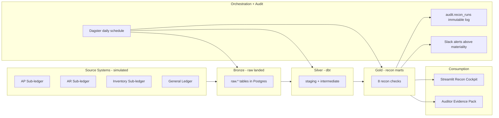

# Daily General Ledger Reconciliation

Reconciliation-as-code for finance: a daily, automated pipeline that proves AP, AR, and Inventory sub-ledgers tie out to the General Ledger — modeled on the controls a Big-4-audited finance team would actually ship.


---

## TL;DR

A production-shaped GL reconciliation system built for a senior data analyst / analytics engineer portfolio. Generates ~50K realistic AP / AR / Inventory / GL postings with intentional breaks (timing, amount, missing posting, unauthorized JE, FX rounding), then reconciles them with declarative tolerance rules in dbt + Python and surfaces results in a Streamlit cockpit with a SOX-style audit trail.

---

## Why this matters

Daily GL reconciliation is a SOX-relevant control at every public company. A break that goes unflagged for a week can become a material misstatement. Modern finance-data teams are moving away from manual BlackLine workbooks toward **reconciliation-as-code**: declarative rules in git, versioned tolerances, automated daily runs, materiality-thresholded alerts, and immutable audit evidence. This project demonstrates that pattern end-to-end.

---

## Architecture



---

## Tech stack

| Layer | Tool | Why |
|---|---|---|
| **Core: Storage** | PostgreSQL 16 | Same SQL surface as Snowflake/Redshift. Schemas mirror a medallion warehouse (`raw`, `staging`, `intermediate`, `marts`, `audit`). |
| **Core: Transformation** | dbt-core 1.8+ | The 2026 industry standard for analytics-engineering. Models, tests, snapshots, contracts, unit tests. |
| **Core: Recon engine** | Python 3.13 (typed, pydantic v2, structlog) | Tolerance-based matching, break categorization, reusable across recons. |
| Supporting: Orchestration | Dagster | Daily schedule + asset checks. (Phase 3) |
| Supporting: Validation | Great Expectations | Source-layer expectation suites. (Phase 2) |
| Supporting: UI | Streamlit | 4-page Recon Cockpit. (Phase 4) |
| Supporting: Alerting | Slack webhook | Materiality-thresholded daily digest. (Phase 3) |
| Supporting: Containerization | Docker | One `docker-compose.yml` for Postgres. |

The supporting stack is deliberately minimal. **The interview is about SQL, dbt, and Python.**

---

## Quickstart

```bash
git clone <this repo> && cd gl-reconciliation
cp .env.example .env
pyenv virtualenv 3.13.3 gl_env && pyenv local gl_env   # one-time
make install               # pip install -e ".[dev]" inside gl_env
make up                    # start Postgres in Docker
make seed                  # generate synthetic data + load into Postgres
```

Then verify:

```bash
python -m data_generator.cli summary
```

You should see ~50K rows across the `raw.*` tables and a row-count breakdown of the injected breaks by class.

---

## What's inside

### Phase 1 — Data foundation (this commit)

- **Postgres bronze layer** with FK-constrained AP/AR/Inventory/GL tables and a SOX-style `audit.recon_runs` table. See [`db/init/`](db/init/).
- **Synthetic data generator** in Python (Faker, numpy, pandas) producing 90 days of multi-entity, multi-currency postings. Deterministic via `--seed`. See [`data_generator/`](data_generator/).
- **Realistic break injection** across five classes (timing, amount, missing posting, unauthorized JE, FX rounding) with a side-channel `_breaks_log.csv` so tests can assert on exactly what was perturbed. See [`data_generator/inject_breaks.py`](data_generator/inject_breaks.py).
- **Typer CLI** (`generate`, `load`, `seed`, `summary`) with rich-formatted output and structlog JSON logging.
- **Smoke tests** asserting double-entry balance on the clean GL feed and reproducibility of the injected breaks. See [`tests/`](tests/).

### Phase 2 — dbt recon engine (next)

8 reconciliation checks implemented as dbt models:
control-account balance, roll-forward proof, transaction-level matching with tolerance, variance analysis, aging, FX revaluation, suspense monitor, manual-JE flag.

### Phase 3 — Orchestration + audit (next)

Dagster daily schedule, asset checks, Slack alerts, and append-only `audit.recon_runs` evidence.

### Phase 4 — Streamlit + delivery (next)

4-page Recon Cockpit (Scorecard, Break Detail, Aging, Auditor Evidence) and a polished demo for the portfolio.

---

## Project structure

```
gl-reconciliation/
├── docker-compose.yml          # Postgres only
├── pyproject.toml              # uv-managed Python project
├── Makefile                    # 3-command quickstart
├── db/init/                    # SQL bootstrap (auto-run by Postgres)
│   ├── 01_schemas.sql
│   ├── 02_dimensions.sql
│   ├── 03_subledgers.sql
│   ├── 04_gl.sql
│   └── 05_audit.sql
├── data_generator/             # Phase 1: synthetic data + loader
│   ├── config.py               # pydantic-settings
│   ├── reference.py            # COA + entities + FX rates
│   ├── subledgers.py           # AP / AR / Inventory generators
│   ├── gl.py                   # double-entry GL generator
│   ├── inject_breaks.py        # 5 break classes
│   ├── pipeline.py             # end-to-end orchestrator
│   ├── loader.py               # COPY-based Postgres loader
│   └── cli.py                  # Typer CLI
└── tests/                      # pytest smoke tests
```

---

## Roadmap

- Phase 2: dbt project with 8 recon checks, snapshots, model contracts, dbt unit tests, hosted `dbt docs`.
- Phase 3: Dagster orchestration, Slack alerting, append-only audit trail.
- Phase 4: Streamlit Recon Cockpit + auditor evidence pack export + demo GIF.
- Stretch: intercompany eliminations; Polars-based matching engine for >1M rows; Snowflake adapter swap.

---

## License

MIT
